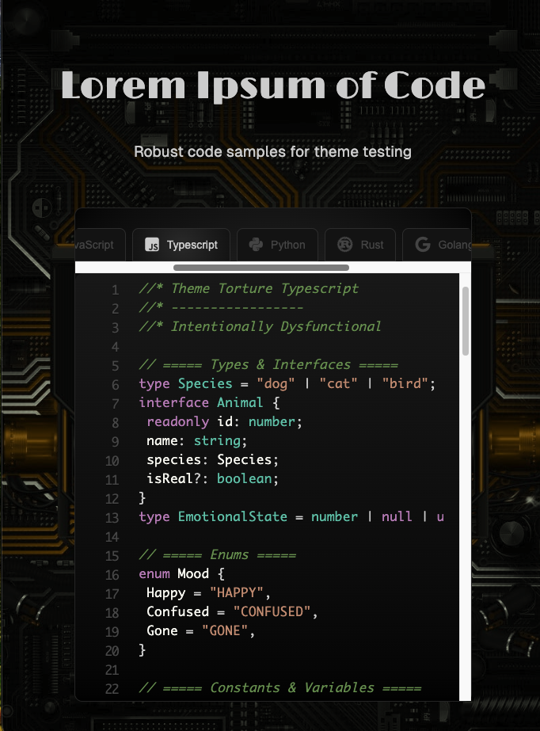

# Lorem Codesum

Lorem Codesum is a theme tester for ten different codes using HTML, JavaScript, and CSS.

## How to Use

1. Download repository and extract 
2. Edit theme colors in style.css, starting at line 223
3. Open index.html on a local host to see your theme across robust dummy data in ten languages

## Notes
- Currently references Prism. Use language name assigner in JS for easy swap to other syntax libraries.
- Each language has a safe and robust "torture template" that is easy to edit in pre and in CSS for theme testing.
- Ran into some issues with HTML being that kid who reads EVERYTHING and takes it literally. Solved by swapping out <> for $g/lt;.